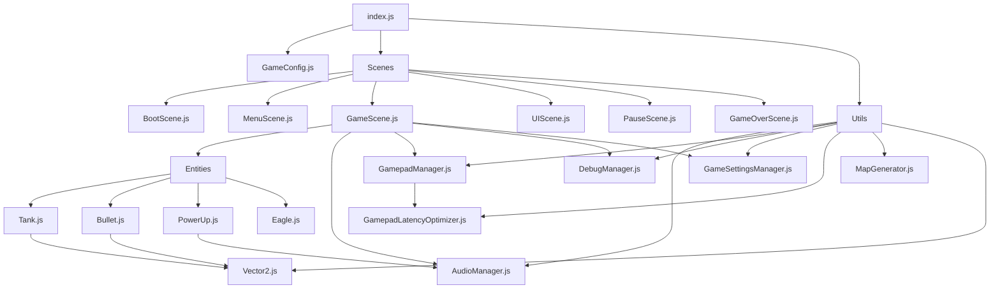

# Design Document: Code Refactoring

## Overview

This design document outlines the approach for refactoring the existing tank game codebase into a modular structure. The refactoring will organize the code into logical modules based on functionality, making it more maintainable, easier to understand, and better structured for future development. The refactored code will maintain all existing features and behaviors while improving code organization.

## Architecture

The refactored code will follow a modular architecture with clear separation of concerns. The main components of the architecture are:

1. **Entry Point**: The main HTML and JavaScript files that initialize the game
2. **Configuration**: Centralized game parameters and settings
3. **Scenes**: Different game states and screens
4. **Entities**: Game objects like tanks, bullets, and obstacles
5. **Utilities**: Shared functionality like audio, input handling, and debugging

The architecture will use ES6 modules for better code organization and dependency management. Each module will export its functionality, and other modules will import what they need.

## Components and Interfaces

### Entry Point

#### index.html
- Main HTML file that loads all necessary CSS and JavaScript
- Contains the game container and UI elements
- Loads the main JavaScript file (index.js)

#### index.js
- Main JavaScript entry point
- Initializes all necessary modules
- Sets up the game loop
- Manages the current scene

### Configuration

#### GameConfig.js
- Contains all game parameters
- Organized into logical sections (player, enemy, bullet, etc.)
- Exported as a single configuration object

### Scenes

#### BootScene.js
- Initializes the game
- Loads necessary assets
- Transitions to the menu scene

#### MenuScene.js
- Displays the main menu
- Handles menu navigation
- Transitions to the game scene when the player starts the game

#### GameScene.js
- Main gameplay scene
- Manages the game state
- Updates and renders game entities
- Handles game logic

#### UIScene.js
- Manages the game UI
- Displays player health, score, etc.
- Updates UI elements based on game state

#### PauseScene.js
- Displays when the game is paused
- Handles pause menu options
- Resumes the game when the player unpauses

#### GameOverScene.js
- Displays when the game ends
- Shows final score and statistics
- Allows the player to restart or return to the menu

### Entities

#### Tank.js
- Represents a tank entity
- Handles tank movement, shooting, and collision
- Manages tank state (health, ammo, etc.)

#### Bullet.js
- Represents a bullet entity
- Handles bullet movement and collision
- Manages bullet state (damage, speed, etc.)

#### PowerUp.js
- Represents a power-up entity
- Handles power-up effects
- Manages power-up state (type, duration, etc.)

#### Eagle.js
- Represents the eagle entity
- Handles eagle state and collision
- Manages eagle protection

### Utilities

#### Vector2.js
- Utility class for 2D vector operations
- Used for position, velocity, and direction calculations

#### AudioManager.js
- Manages game audio
- Plays sound effects and music
- Controls audio volume and muting

#### GamepadManager.js
- Handles gamepad input
- Maps gamepad buttons to game actions
- Supports multiple gamepads

#### GamepadLatencyOptimizer.js
- Optimizes gamepad input latency
- Provides input prediction and smoothing
- Monitors and reports latency statistics

#### DebugManager.js
- Manages debug functionality
- Logs debug information
- Provides debug UI

#### GameSettingsManager.js
- Manages game settings
- Saves and loads settings
- Provides settings UI

#### MapGenerator.js
- Generates game maps
- Places obstacles and entities
- Creates different map layouts

## Data Models

### Tank
```javascript
{
  x: Number,              // X position
  y: Number,              // Y position
  angle: Number,          // Tank angle
  turretAngle: Number,    // Turret angle
  color: String,          // Tank color
  controls: Object,       // Control mapping
  isPlayer: Boolean,      // Is this a player tank?
  level: Number,          // Tank level
  playerIndex: Number,    // Player index (for multiplayer)
  width: Number,          // Tank width
  height: Number,         // Tank height
  speed: Number,          // Movement speed
  maxHealth: Number,      // Maximum health
  health: Number,         // Current health
  ammo: Number,           // Current ammo
  lastShot: Number,       // Time since last shot
  shootCooldown: Number,  // Cooldown between shots
  alive: Boolean,         // Is the tank alive?
  // Additional properties for power-ups, AI, etc.
}
```

### Bullet
```javascript
{
  x: Number,              // X position
  y: Number,              // Y position
  angle: Number,          // Bullet angle
  speed: Number,          // Movement speed
  owner: Object,          // Reference to the tank that fired the bullet
  damage: Number,         // Damage amount
  life: Number,           // Bullet lifetime
  // Additional properties for special bullet types
}
```

### PowerUp
```javascript
{
  x: Number,              // X position
  y: Number,              // Y position
  type: String,           // Power-up type
  duration: Number,       // Effect duration
  collected: Boolean,     // Has the power-up been collected?
  // Additional properties for specific power-up types
}
```

### Eagle
```javascript
{
  x: Number,              // X position
  y: Number,              // Y position
  width: Number,          // Eagle width
  height: Number,         // Eagle height
  health: Number,         // Current health
  maxHealth: Number,      // Maximum health
  protected: Boolean,     // Is the eagle protected?
  protectionTime: Number, // Protection duration
}
```

## Error Handling

The refactored code will include robust error handling to prevent crashes and provide useful debugging information:

1. **Defensive Programming**: Check for null/undefined values before using them
2. **Try-Catch Blocks**: Wrap critical code in try-catch blocks to prevent crashes
3. **Fallback Values**: Provide default values when expected values are missing
4. **Error Logging**: Log errors to the console with descriptive messages
5. **Graceful Degradation**: Continue functioning with reduced features when errors occur

Example:
```javascript
try {
  // Attempt to load game configuration
  const config = GameConfig.player;
  this.speed = config ? config.speed : 100; // Fallback to default value
} catch (error) {
  console.error('Failed to load player configuration:', error);
  this.speed = 100; // Use default value
}
```

## Testing Strategy

The refactoring will be tested to ensure that all existing functionality works as expected:

1. **Manual Testing**: Play the game to verify that all features work as before
2. **Unit Testing**: Test individual modules in isolation
3. **Integration Testing**: Test interactions between modules
4. **Regression Testing**: Verify that no existing functionality is broken
5. **Performance Testing**: Ensure that the refactored code performs as well as the original

Testing will focus on:
- Game initialization and scene transitions
- Player movement and shooting
- Enemy AI and behavior
- Collision detection and resolution
- Power-up effects
- Game settings and audio
- Gamepad input and latency optimization

## Module Dependencies



## File Structure

```
src/
├── config/
│   └── GameConfig.js          # Game configuration file
├── scenes/
│   ├── BootScene.js           # Boot scene
│   ├── MenuScene.js           # Menu scene
│   ├── GameScene.js           # Main game scene
│   ├── UIScene.js             # UI scene
│   ├── PauseScene.js          # Pause scene
│   └── GameOverScene.js       # Game over scene
├── entities/
│   ├── Tank.js                # Tank entity
│   ├── Bullet.js              # Bullet entity
│   ├── PowerUp.js             # Power-up entity
│   └── Eagle.js               # Eagle entity
├── utils/
│   ├── Vector2.js             # 2D vector utility
│   ├── AudioManager.js        # Audio management
│   ├── GamepadManager.js      # Gamepad input handling
│   ├── GamepadLatencyOptimizer.js # Gamepad latency optimization
│   ├── DebugManager.js        # Debug functionality
│   ├── GameSettingsManager.js # Game settings management
│   └── MapGenerator.js        # Map generation
├── index.html                 # Main HTML file
└── index.js                   # Main JavaScript entry point
```

## Implementation Considerations

1. **Backward Compatibility**: The refactored code must maintain all existing functionality
2. **Performance**: The refactoring should not negatively impact performance
3. **Code Reuse**: Identify and extract common functionality into reusable modules
4. **Minimal Changes**: Avoid changing implementation details or algorithms
5. **Progressive Refactoring**: Refactor one module at a time to minimize risk
6. **Testing**: Test each module after refactoring to ensure it works as expected

## Migration Strategy

The refactoring will follow these steps:

1. Create the new directory structure
2. Extract the configuration into GameConfig.js
3. Extract utility classes (Vector2, AudioManager, etc.)
4. Extract entity classes (Tank, Bullet, etc.)
5. Extract scene classes (BootScene, MenuScene, etc.)
6. Create the main entry point (index.js)
7. Update the HTML file to use the new structure
8. Test the refactored code to ensure it works as expected

This approach allows for incremental refactoring and testing, reducing the risk of introducing bugs.